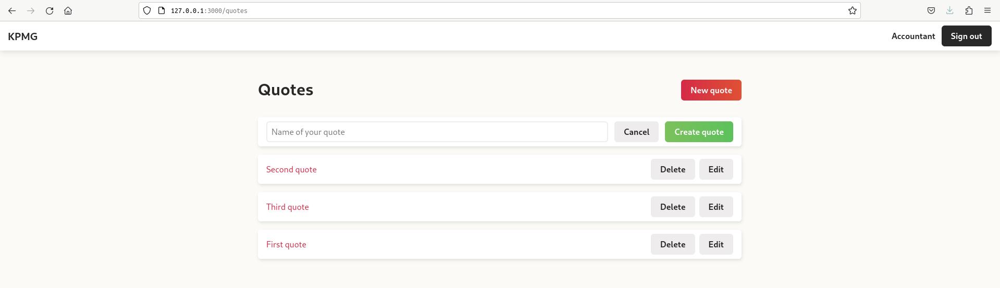
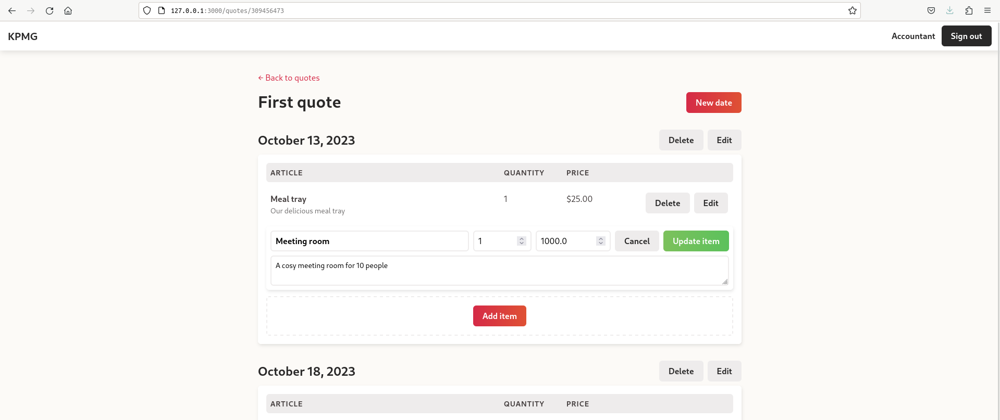

# Hotrails

This project is a follow along for the [hotwire](https://hotwired.dev/)
tutorial from [hotrails.dev](https://www.hotrails.dev/)

## Setup

### Requirements

- Ruby 3.1.2 (This is now unsupported, DO NOT USE in production)
- Rails 7.0.7
- Nodejs 20.8.0

### Commands

- asdf install ruby 3.1.2
- asdf local ruby 3.1.2
- Confirm ruby 3.1.2 is set using ruby -v

- gem install bundler:2.4.18
- bundle install

- asdf install nodejs 20.8.0
- asdf local nodejs 20.8.0
- npm install yarn
- npm install -g yarn
- yarn install

- bundle exec rails db:migrate
- bundle exec rails db:seed

- Ensure Redis server is running locally

- bin/dev

### Access Application

- Visit [127.0.0.1:3000](http://127.0.0.1:3000/)

- There are two companies and three users seeded into the application.
- Company KPMG has accountant@kpmg.com & manager@kpmg.com
- Company PWC has eavesdropper@pwc.com
- All three users have the password of *password*

### Run tests

- bundle exec rails test
- bundle exec rails test:system
